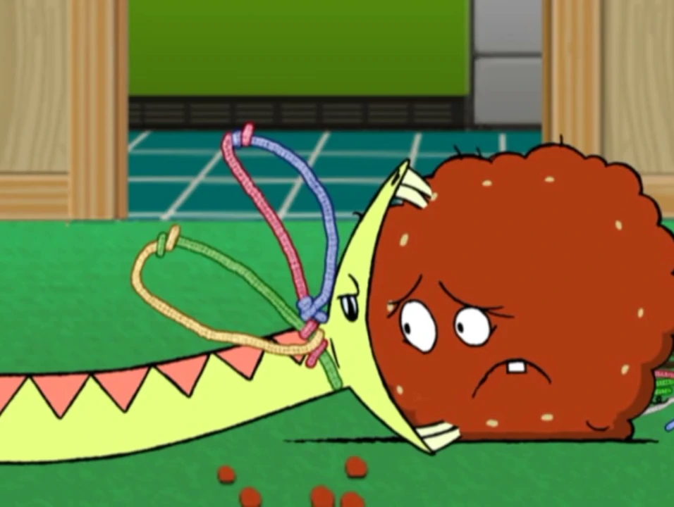

# Nathan Bot Philips (Recurrent)

Just some experimental code to teach a LSTM network to play rocket league. The
bulk of this code is copied from Impossibum's [Rocket League Reinforcement
Learning Bot Quick Start Tutorial
Guide](https://www.youtube.com/watch?v=C92_UFZ1W-U), with light modifications
to make it work with the experimental [sb3_contrib
feat/ppo-lstm](https://github.com/Stable-Baselines-Team/stable-baselines3-contrib/tree/feat/ppo-lstm)
branch.

This model is currently in training, so I have no idea if this will work yet or
not. Check back for updates.

